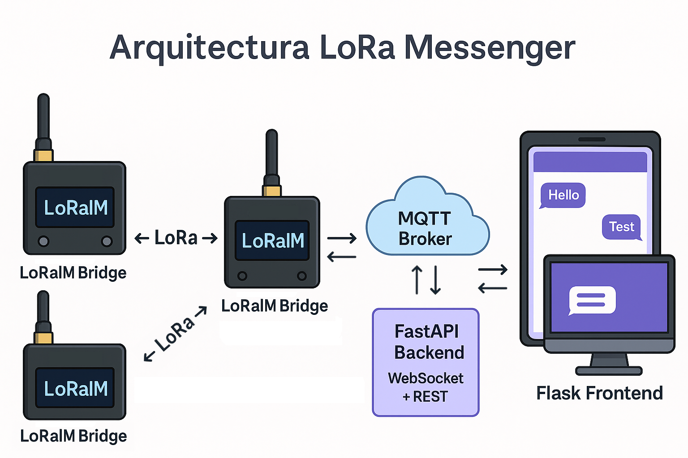
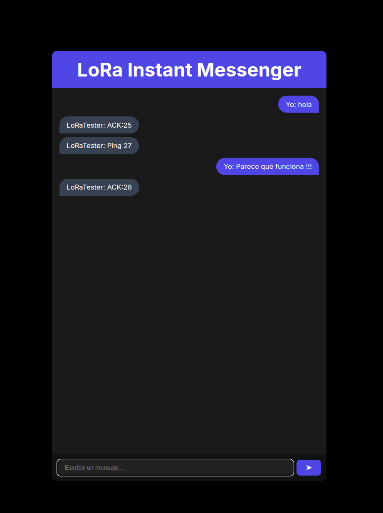

# LoRaIM (LoRa Instant Messenger)


## Project Overview

**LoRaIM (LoRa Instant Messenger)** is an experimental messaging platform designed to operate **without traditional infrastructure** (no cellular, Wi-Fi, or internet) using **LoRa (Long Range) radio communication**. It enables **off-grid, long-range, low-power text messaging** between embedded nodes, making it ideal for rural areas, natural disasters, or isolated environments.

LoRaIM provides:
- A frontend web chat interface (Flask + JS)
- A FastAPI backend with MQTT/WebSocket bridge
- LoRa-enabled hardware nodes (Heltec LoRa 32 V3 with MicroPython)

## Features

- Peer-to-peer messaging over LoRa (868 MHz, configurable)
- Lightweight web chat client with real-time updates via WebSockets
- Backend connected to MQTT broker (Mosquitto)
- Dockerized deployment for all services
- Dynamic node identification (`Node-XXXXXX`)
- Message buffer on bridge node in case of MQTT disconnection
- Test node firmware that auto-sends `Ping` every 30 seconds
- OLED display on nodes for real-time message status

## Architecture

```
[LoRaIM Node A] <--LoRa--> [Bridge Node (Wi-Fi + LoRa)] <--MQTT--> [FastAPI Backend] <--WebSocket--> [Flask Frontend Web Chat]
```

Each hardware node communicates directly over LoRa. The bridge node acts as a relay to the MQTT server running on the same local Docker network as the backend. The backend distributes messages to connected clients via WebSockets.

## Technologies

| Component      | Tech / Tool        |
|----------------|--------------------|
| Backend        | FastAPI + Paho MQTT |
| Frontend       | Flask, HTML/CSS/JS |
| Messaging      | MQTT (Mosquitto)   |
| Transport      | LoRa (SX1262)      |
| Firmware       | MicroPython (ESP32)|
| Deployment     | Docker + Docker Compose |

## Project Structure

```bash
LoRaIM/
├── api/                # FastAPI backend
│   ├── app/
│   └── requirements.txt
├── frontend/           # Flask frontend
│   ├── templates/index.html
│   ├── static/css/style.css
│   ├── static/js/chat.js
├── uPython/            # MicroPython firmware
│   ├── Heltec_V3_uP_Bridge_Node/
│   └── Heltec_V3_uP_Test_Node/
├── mosquitto/          # MQTT broker config
├── docker-compose.yml
└── README.md
```

## Installation & Deployment

### Requirements

- Docker & Docker Compose
- Heltec LoRa 32 V3 modules (ESP32-S3 + SX1262)
- Wi-Fi network

### 1. Clone and run the system:

```bash
git clone https://github.com/v1ct0rjs/LoRaIM.git
cd LoRaIM
docker-compose up --build
```

### 2. Flash firmware to Heltec modules

- Use [Thonny](https://thonny.org/) or `ampy` to upload MicroPython code to `/flash`
- Edit `.env` with your Wi-Fi and MQTT broker config

### 3. Access frontend

Open your browser at:  
👉 `http://localhost:5000`

## Protocol

Messages are formatted as JSON:
```json
{"from": "Node-123ABC", "message": "Hello!"}
```

- Bridge node relays messages LoRa ↔ MQTT
- Backend distributes via WebSocket
- Frontend renders messages with "You" for local, or node name for received

## Security Notes

- No encryption by default (LoRa P2P mode)
- Future versions may support AES at firmware level

## Testing Scenarios

- ✅ Bidirectional messaging with acknowledgment
- ✅ MQTT disconnection and reconnection handling
- ✅ Multi-node simulation
- ✅ Signal strength display (RSSI/SNR on OLED)

## Screenshots & Diagrams




## Documentation

See the full [PDF Documentation](./Documentacion_LoRaIM_Victor_Jiménez.pdf) (in Spanish) for theory, implementation, and analysis.

---

> © 2025 Víctor Manuel Jiménez Sánchez. LoRaIM is an open-source project under GPL v3 license.

